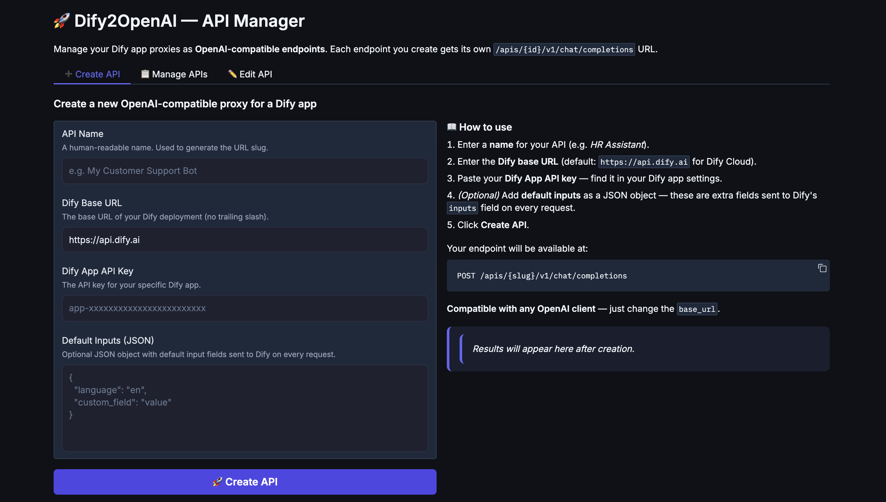

<div align="center">

<h1>
  
</h1>

<p>
  <strong>A lightweight, high-performance API gateway that bridges <a href="https://dify.ai">Dify</a> applications with any OpenAI-compatible client.</strong>
</p>

<p>
  <a href="#-features">Features</a> •
  <a href="#-quick-start">Quick Start</a> •
  <a href="#-docker">Docker</a> •
  <a href="#-configuration">Configuration</a> •
  <a href="#-api-reference">API Reference</a> •
  <a href="#-project-structure">Structure</a>
</p>

<p>
  
  
  
  
</p>

</div>

---

## ✨ Features

| Feature | Description |
|---|---|
| 🎨 **Web UI Manager** | Built-in beautiful dark-mode dashboard to create and manage multiple Dify proxies easily |
| 🔌 **OpenAI-compatible API** | Drop-in `/v1/chat/completions` endpoint — plug into any OpenAI client without code changes |
| ⚡ **Streaming & Blocking** | Full support for Server-Sent Events (SSE) streaming and standard blocking responses |
| 🧹 **Output Cleaning** | Automatically strips internal LLM tokens: `<show>`, `<\|start_think\|>`, `<checklist>`, bracket prefixes, and extra whitespace |
| 🔑 **Bearer Token Passthrough** | Your Dify API key travels as the standard `Authorization: Bearer` header — no extra config needed |
| 🗂️ **Dynamic Inputs** | Configure Dify `inputs` fields at runtime via a single `DIFY_INPUTS_DEFAULTS` environment variable — no code changes required |
| 🔄 **LiteLLM compatible** | Works seamlessly as a backend model in [LiteLLM](https://github.com/BerriAI/litellm) proxy configurations |

---

## 🚀 Quick Start

### Prerequisites

- Python **3.12+**
- [`uv`](https://github.com/astral-sh/uv) (recommended) or `pip`
- A running [Dify](https://dify.ai) instance and a valid **API key**

### 1. Clone the repository

```bash
git clone https://github.com/trungviet17/dify2openai.git
cd dify2openai
```

### 2. Install dependencies

```bash
# Using uv (recommended — much faster)
uv sync

# Or using pip
pip install -r requirements.txt
```

### 3. Configure environment

Create a `.env` file in the project root:

```env
# Required: URL of your Dify instance
DIFY_BASE_URL=https://api.dify.ai

# Optional: Default input fields for Dify workflows (JSON object)
# These fields are injected into every request's "inputs" payload.
DIFY_INPUTS_DEFAULTS={"customField": ""}
```

### 4. Run the server

```bash
# Using the convenience script (recommended)
bash run.sh

# Or directly with uvicorn
source .venv/bin/activate   
uvicorn app:app --host 0.0.0.0 --port 8000 --reload
```

The server is now available at **http://localhost:8000**.  
The **Web UI Manager** is available at **http://localhost:8000/ui**.

<div align="center">
  
</div>

---

## 🐳 Docker

### Build the image

```bash
docker build -t dify2openai:latest .
```

### Run with Docker

```bash
docker run -d \
  --name dify2openai \
  -p 8000:8000 \
  -e DIFY_BASE_URL=https://api.dify.ai \
  -e DIFY_INPUTS_DEFAULTS='{"customField": ""}' \
  dify2openai:latest
```

### Run with Docker Compose

Create a `docker-compose.yml`:

```yaml
version: "3.9"

services:
  dify2openai:
    image: dify2openai:latest
    build: .
    ports:
      - "8000:8000"
    environment:
      - DIFY_BASE_URL=https://api.dify.ai
      - DIFY_INPUTS_DEFAULTS={"customField": ""}
    restart: unless-stopped
    healthcheck:
      test: ["CMD", "curl", "-f", "http://localhost:8000/health"]
      interval: 30s
      timeout: 5s
      retries: 3
```

Then start with:

```bash
docker compose up -d
```

> **Note:** The Docker image uses a multi-stage build. Stage 1 resolves dependencies with `uv`; Stage 2 produces a minimal runtime image running as a non-root user for security.

---

## ⚙️ Configuration

### Environment Variables

| Variable | Default | Description |
|---|---|---|
| `DIFY_BASE_URL` | `https://api.dify.ai` | Base URL of your Dify instance (no trailing slash) |
| `DIFY_INPUTS_DEFAULTS` | `{}` | JSON object of default `inputs` fields passed to every Dify request |

### `run.sh` Server Variables

Control the Uvicorn server without editing any code:

| Variable | Default | Description |
|---|---|---|
| `HOST` | `0.0.0.0` | Bind address |
| `PORT` | `8000` | Bind port |
| `WORKERS` | `1` | Number of Uvicorn worker processes |
| `LOG_LEVEL` | `info` | Uvicorn log level (`debug`, `info`, `warning`, `error`) |
| `RELOAD` | `false` | Set to `true` to enable hot-reload (development mode) |

**Examples:**

```bash
# Development mode with hot-reload
RELOAD=true bash run.sh

# Production mode with 4 workers
WORKERS=4 PORT=8080 bash run.sh
```

---

## 📡 API Reference

### `POST /v1/chat/completions`

Accepts a standard OpenAI Chat Completions request and proxies it to Dify.

**Authentication:** The `Authorization: Bearer <your-dify-api-key>` header is required and its token is forwarded directly to Dify as the API key.

**Request body:**

```json
{
  "model": "dify",
  "messages": [
    { "role": "system", "content": "You are a helpful assistant." },
    { "role": "user", "content": "Hello! Who are you?" }
  ],
  "stream": true
}
```

**cURL example (streaming):**

```bash
curl http://localhost:8000/v1/chat/completions \
  -H "Authorization: Bearer YOUR_DIFY_API_KEY" \
  -H "Content-Type: application/json" \
  -d '{
    "model": "dify",
    "messages": [{"role": "user", "content": "Hello!"}],
    "stream": true
  }'
```

**cURL example (blocking):**

```bash
curl http://localhost:8000/v1/chat/completions \
  -H "Authorization: Bearer YOUR_DIFY_API_KEY" \
  -H "Content-Type: application/json" \
  -d '{
    "model": "dify",
    "messages": [{"role": "user", "content": "Hello!"}],
    "stream": false
  }'
```

**Python (OpenAI SDK) example:**

```python
from openai import OpenAI

client = OpenAI(
    base_url="http://localhost:8000/v1",
    api_key="YOUR_DIFY_API_KEY",
)

response = client.chat.completions.create(
    model="dify",
    messages=[{"role": "user", "content": "Hello!"}],
    stream=True,
)

for chunk in response:
    print(chunk.choices[0].delta.content, end="", flush=True)
```

---

### `GET /health`

Returns a simple health check response. Use this for load balancer probes.

```bash
curl http://localhost:8000/health
# → {"status": "ok"}
```

---

## 🗂️ Project Structure

```
dify2openai/
├── app.py                      # FastAPI application entrypoint
├── run.sh                      # Uvicorn launcher script (configurable via env vars)
├── Dockerfile                  # Multi-stage production Docker image
│
└── src/
    ├── config.py               # Environment variable loading (DIFY_BASE_URL, DIFY_INPUTS_DEFAULTS)
    ├── routers/
    │   └── chat.py             # POST /v1/chat/completions route handler
    ├── schemas/
    │   ├── openai_schemas.py   # Pydantic models for OpenAI request/response format
    │   └── dify_schemas.py     # Pydantic models for Dify API request format
    └── services/
        └── dify_service.py     # Core logic: request conversion, streaming, output cleaning
```

---

## 🔧 How It Works

```
OpenAI Client
     │
     │  POST /v1/chat/completions
     │  Authorization: Bearer <DIFY_API_KEY>
     ▼
dify2openai (FastAPI)
     │
     ├─ Extracts last user message as Dify "query"
     ├─ Merges DIFY_INPUTS_DEFAULTS into the request "inputs"
     ├─ Forwards request → Dify /v1/chat-messages
     │
     ├─ Streaming: Parses Dify SSE events → re-emits as OpenAI SSE chunks
     └─ Blocking: Receives Dify JSON → maps to OpenAI ChatCompletion response
```
---

## 📄 License

This project is licensed under the **MIT License** — see the [LICENSE](LICENSE) file for details.

